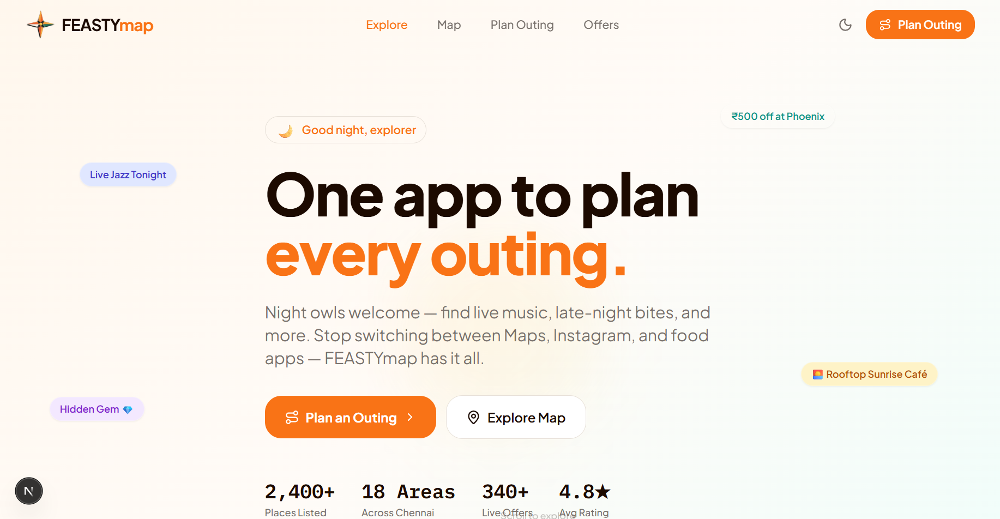
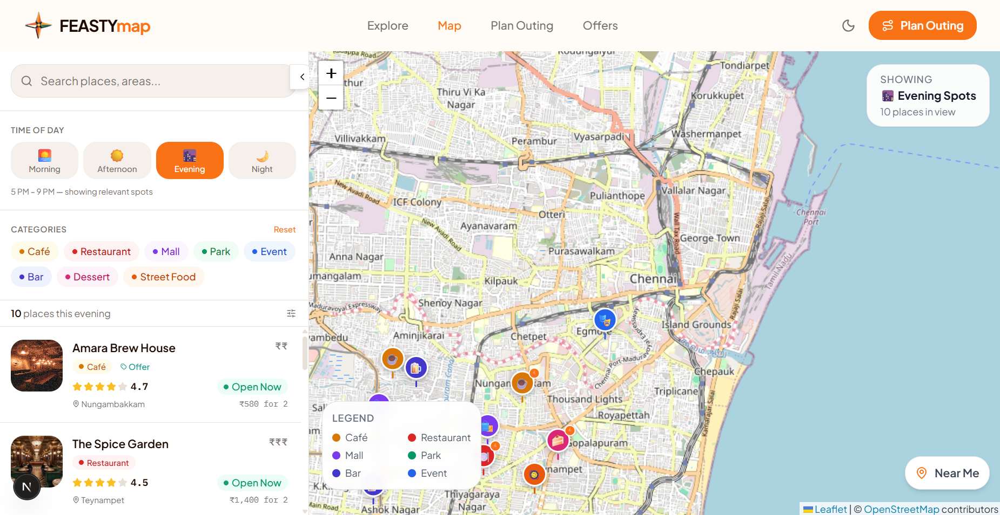
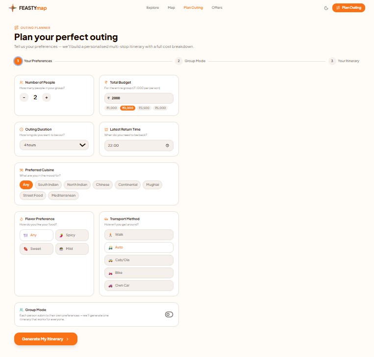
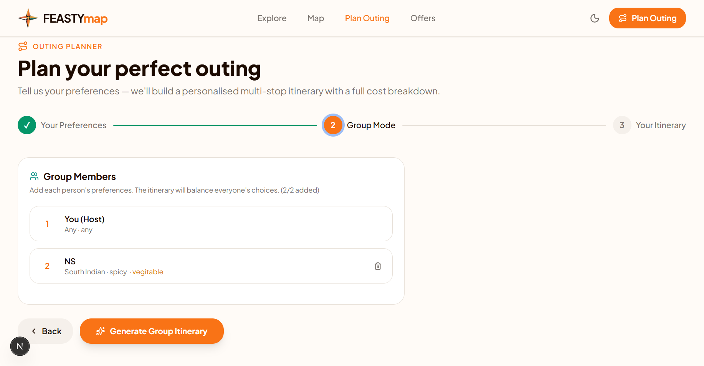
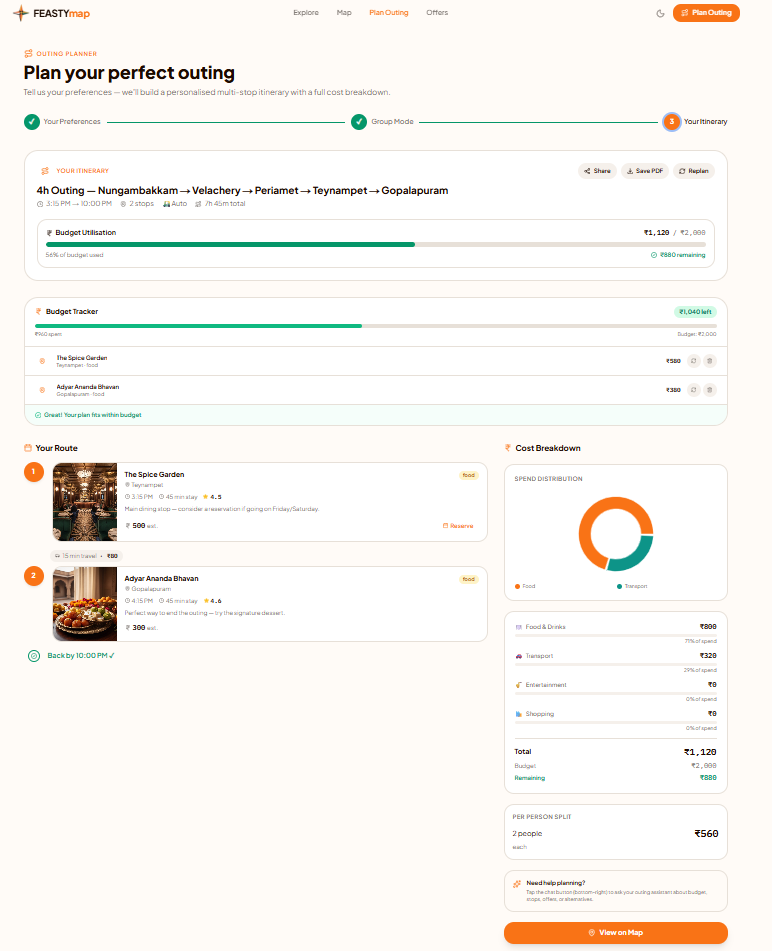

# FEASTYMAP

**Smart City Exploration and Outing Planning Platform**

FEASTYMAP is a web application that helps users discover restaurants, cafes, parks, malls, street food, and entertainment destinations through an interactive map while generating personalized outing plans based on budget, duration, transportation, cuisine preferences, return time, and group size.

---

## Live Demo

**Production Deployment:** https://feastymap.vercel.app/outing-planner

FEASTYMAP is deployed on **Vercel** using the Next.js App Router.

---

## Tech Stack

| Technology        | Purpose                           |
| ----------------- | --------------------------------- |
| **Next.js 15**    | Full-stack React framework        |
| **React 19**      | User interface development        |
| **TypeScript**    | Type-safe development             |
| **Tailwind CSS**  | Responsive UI styling             |
| **Leaflet**       | Interactive maps                  |
| **OpenStreetMap** | Location and map data             |
| **Node.js**       | Runtime environment               |
| **Git & GitHub**  | Version control and collaboration |
| **Vercel**        | Production deployment             |

---

## Features

* Interactive map with category-based location discovery.
* Smart outing planner based on budget, duration, cuisine, transportation, and group size.
* Personalized itinerary with estimated timings and travel information.
* Budget estimation with per-person expense calculation.
* Group outing planning with shared preferences.
* Time-based destination discovery for different parts of the day.
* Explore food, entertainment, offers, and events in one platform.

---

## Screenshots

### Explore



### Interactive Map



### Outing Planner



### Group Planning



### Personalized Itinerary



---

## Project Structure

```text
FEASTYMAP/
├── src/
│   ├── app/
│   │   ├── interactive-map/
│   │   └── outing-planner/
│   ├── components/
│   ├── lib/
│   └── styles/
├── public/
├── screenshots/
├── package.json
├── next.config.mjs
└── README.md
```

---

## Application Flow

```text
User Preferences
      │
      ▼
Smart Outing Planner
      │
      ▼
Recommendation Engine
      │
      ▼
Destination Selection
      │
      ▼
Budget • Time • Transportation Analysis
      │
      ▼
Personalized Itinerary
```

---

## Getting Started

### Prerequisites

* Node.js
* npm
* Git

### Clone the Repository

```bash
git clone https://github.com/SharwinX17vg/FEASTYMAP.git
cd FEASTYMAP
```

### Install Dependencies

```bash
npm install
```

### Run the Development Server

```bash
npm run dev
```

Open **http://localhost:4028** in your browser.

---

## Environment Variables

Create a `.env.local` file in the project root.

```env
NEXT_PUBLIC_API_URL=your_api_url
API_KEY=your_api_key
```

Do not commit sensitive credentials to the repository.

---

## Available Scripts

| Command          | Description                          |
| ---------------- | ------------------------------------ |
| `npm run dev`    | Start the development server         |
| `npm run build`  | Build the application for production |
| `npm run start`  | Start the production server          |
| `npm run lint`   | Run ESLint                           |
| `npm run format` | Format the project files             |

---

## Deployment

The application is deployed on **Vercel** and is available at:

**https://feastymap.vercel.app/outing-planner**

The production deployment is optimized for the Next.js App Router and responsive across desktop and mobile devices.

---

## Project Vision

FEASTYMAP brings location discovery, food exploration, entertainment planning, budgeting, and itinerary generation into a single platform to simplify planning outings with friends and family.

---

## Future Scope

* AI-powered destination recommendations.
* Real-time events and business offers.
* Route optimization and travel suggestions.
* User authentication and personalized profiles.
* Saved itineraries and favorite places.
* Ratings and reviews.
* Business and community integration.
